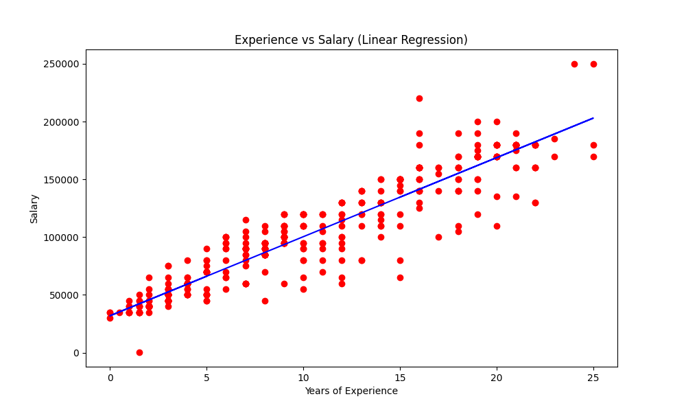

# Análisis de Salarios en Función de la Experiencia Laboral

## Acerca del Conjunto de Datos
Este conjunto de datos ha sido tomado del archivo 'Salary Data.csv' y representa las **tendencias salariales** considerando factores clave:
- **Años de Experiencia:** Mayor experiencia generalmente incrementa el salario.
- **Educación (Bachelor's, Master's, PhD):** Nivel educativo que influye en la compensación.
- **Género:** Factor demográfico que puede influir en la remuneración.

Ideal para:
- Análisis exploratorio de datos (EDA)
- Modelado de regresión
- Análisis de factores que afectan los salarios

---

## Resultados Obtenidos

| Métrica | Regresión Lineal | Regresión Polinómica |
| ------- | ---------------- | -------------------- |
| **R²**  | 0.8655           | 0.9287               |
| **RMSE**| 14,839.72        | 10,793.35            |

---

## Visualización de los Modelos de Regresión




### Explicación del Gráfico
- **Puntos Rojos:** Representan los datos reales de salario para cada nivel de experiencia.
- **Línea Azul:** Representa la curva de ajuste del modelo polinómico de grado 4.

### Interpretación del Modelo
- **Fase Inicial (0-5 años):** Crecimiento rápido del salario en los primeros años de experiencia.
- **Fase Media (5-15 años):** Crecimiento continuo pero con una tasa de incremento que se modera.
- **Fase Avanzada (>15 años):** Tendencia a una estabilización o crecimiento más lento, reflejado en la curvatura del modelo polinómico.

**Conclusiones clave:**
- La relación entre experiencia y salario no es estrictamente lineal, sino que sigue un patrón polinómico.
- El modelo polinómico captura mejor la realidad del mercado laboral, donde los incrementos salariales tienden a ser más pronunciados en etapas tempranas de la carrera.
- La mejora en R² del 0.8655 al 0.9287 confirma que el modelo polinómico ofrece una representación significativamente más precisa.

---

## Ecuación del Modelo Predictivo

### Modelo Lineal
```
Salario = 9,361.93 * Años_Experiencia + 41,539.49
```

### Modelo Polinómico (Grado 4)
```
Salario = 41,288.15 + 3,112.17X¹ + 2,289.73X² - 160.20X³ + 3.40X⁴
```
Donde X representa los años de experiencia.

---

## Análisis Detallado del Modelo

### 1. Punto de Inflexión de la Curva
El modelo polinómico muestra un punto de inflexión aproximadamente a los 12-15 años de experiencia, donde la tasa de crecimiento salarial comienza a disminuir.

### 2. Retorno de la Inversión en Educación
El análisis por nivel educativo muestra un claro incremento salarial asociado a mayores niveles de educación:
- Bachelor's: $74,756 (promedio)
- Master's: $129,796 (promedio)
- PhD: $157,843 (promedio)

### 3. Predicciones para Diferentes Niveles de Experiencia

| Años de Experiencia | Predicción Lineal | Predicción Polinómica |
| ------------------- | ----------------- | --------------------- |
| 2                   | $60,263.35        | $50,264.87            |
| 5                   | $88,349.14        | $79,838.78            |
| 10                  | $135,158.79       | $138,425.61           |
| 15                  | $181,968.44       | $190,503.12           |
| 20                  | $228,778.09       | $227,398.69           |

---

## Recomendaciones:

### Para Profesionales:
- **Inversión en educación superior:** El retorno económico de un Master's o PhD es significativo.
- **Expectativas salariales realistas:** Esperar crecimientos más acelerados en los primeros 10-12 años, seguidos de incrementos más moderados.
- **Negociación salarial:** Utilizar estos datos como referencia al negociar compensaciones según años de experiencia.

### Para Empleadores:
- **Estructuración de compensaciones:** Diseñar escalas salariales que reflejen el patrón no lineal identificado.
- **Retención de talento:** Considerar que los profesionales con 3-8 años de experiencia pueden estar en la fase de mayor incremento salarial, requiriendo estrategias específicas de retención.
- **Políticas de contratación:** Evaluar el costo-beneficio entre contratar profesionales con mucha experiencia versus desarrollar talento interno.

### Para Investigadores:
- **Factores adicionales:** Explorar cómo otras variables como industria, ubicación geográfica o habilidades específicas pueden modificar la curva salarial.
- **Actualizaciones periódicas:** El mercado laboral evoluciona, por lo que estos modelos deben revisarse periódicamente.